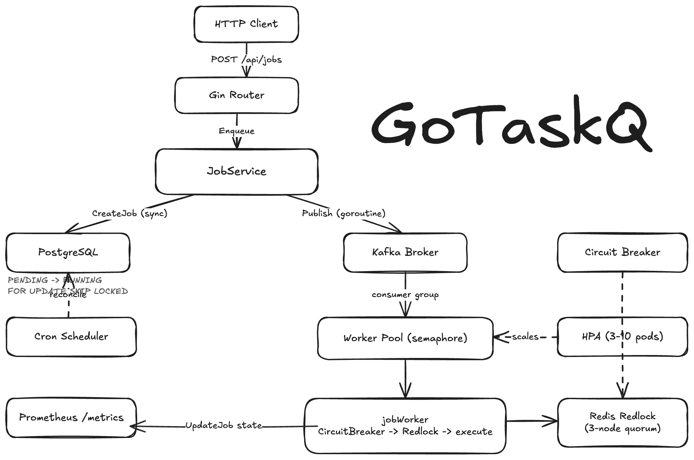

# Conduit

[](https://github.com/JustinK33/Conduit/actions/workflows/ci.yml) [](https://github.com/JustinK33/Conduit/actions/workflows/cd.yml)

<p align="center">
  
</p>

Conduit is a reliable data workflow runtime built on a production-grade distributed task queue written in Go.
It runs webhook jobs and SQL ELT pipelines with Kafka transport, PostgreSQL job state, Redis distributed locking, bounded workers, retry backoff, lease recovery, and Prometheus observability.
It is designed for teams that need dependable background work and lightweight data workflows without adopting a heavyweight orchestration platform.

## Use Case

Conduit is useful when a product team needs dependable background work and lightweight operational analytics without operating a heavyweight workflow platform.
One practical use case is nightly analytics materialization.
The application writes raw events or orders into Postgres, then enqueues a `sql.etl` job that aggregates the raw table into an analytics table.
Conduit handles scheduling, retries, crash recovery, cancellation, idempotency, and metrics while Postgres handles the SQL transformation.

See [docs/use-cases/sql-elt.md](docs/use-cases/sql-elt.md) for the full SQL ELT workflow.

## Stack

| Component | Technology |
|-----------|-----------|
| Transport | Kafka (IBM/sarama) |
| State store | PostgreSQL (pgx v5) |
| Distributed lock | Redis Redlock (go-redis v9) |
| HTTP | Gin |
| Metrics | Prometheus + Grafana |
| Logging | zerolog |
| Infra | Docker Compose, Kubernetes (kind) |

## Quick Start

**Prerequisites:** Docker, Docker Compose, `jq` (optional, for pretty output)

```bash
# 1. Clone and enter the repo
git clone https://github.com/JustinK33/Conduit.git && cd Conduit

# 2. Copy the env file (defaults work with Docker Compose out of the box)
cp .env.example .env

# 3. Start the full stack - waits for all health checks before starting the app
make up

# 4. Enqueue a webhook job
make enqueue url=https://example.com/webhook
# {"id": "5c8058ea-40d6-49f5-9547-cfb37426b368"}

# 5. Check its status
make status id=5c8058ea-40d6-49f5-9547-cfb37426b368
```

## SQL ELT Quick Start

Apply the optional demo schema after the stack is running.

```bash
docker exec -i conduit-postgres-1 psql -U conduit -d conduit < migrations/002_create_elt_demo.sql
```

Enqueue the sample daily revenue pipeline.

```bash
make enqueue-elt
```

The sample pipeline lives at [examples/daily_revenue_pipeline.json](examples/daily_revenue_pipeline.json).
It reads from `raw.orders`, filters paid orders, groups by day, and loads `analytics.daily_revenue`.

## API

All endpoints are under `http://localhost:8080`.

### Enqueue a job

```bash
curl -X POST http://localhost:8080/api/jobs \
  -H "Content-Type: application/json" \
  -d '{
    "idempotency_key": "send-email-user-123",
    "task": {
      "name": "webhook",
      "payload": "eyJ0byI6InVzZXJAZXhhbXBsZS5jb20ifQ==",
      "metadata": {
        "url": "https://example.com/webhook",
        "method": "POST"
      }
    }
  }'
```

```json
{"id": "5c8058ea-40d6-49f5-9547-cfb37426b368"}
```

### List jobs

```bash
curl 'http://localhost:8080/api/jobs?state=FAILED&limit=20'
```

```json
{
  "jobs": [{"id": "...", "state": "FAILED", ...}, ...],
  "next_cursor": "MTcxODcxNjQwMHwxMjMtNDU2"
}
```

Pass `next_cursor` back as `?cursor=...` to fetch the next page. Empty string means "no more results."

### Get job status

```bash
curl http://localhost:8080/api/jobs/<id>
```

```json
{
  "id": "5c8058ea-40d6-49f5-9547-cfb37426b368",
  "task": {"name": "send-email", ...},
  "state": "PENDING",
  "attempt": 0,
  "scheduled_at": "2026-06-18T21:22:51Z",
  "created_at": "2026-06-18T21:22:51Z",
  "updated_at": "2026-06-18T21:22:51Z"
}
```

### Get a job by idempotency key

```bash
curl http://localhost:8080/api/jobs/by-idempotency-key/send-email-user-123
```

Use this when a client retried an enqueue request and only has the original `idempotency_key`.
The response is the same job object returned by `GET /api/jobs/<id>`.

### Cancel a job

```bash
curl -X POST http://localhost:8080/api/jobs/<id>/cancel
```

### Health probes

```bash
curl http://localhost:8080/live    # Liveness - 200 if process is up
curl http://localhost:8080/ready   # Readiness - pings Postgres + Redis quorum
```

`/ready` returns `503` with per-dependency status if any required dependency is down. `/health` is kept as a backward-compat alias for `/live`.

### Error responses

Every error follows the same envelope, including a `request_id` for log correlation:

```json
{
  "error": {
    "code": "not_found",
    "message": "job not found",
    "request_id": "03121cd0a8fcb769"
  }
}
```

Stable error codes: `invalid_request`, `not_found`, `invalid_state`, `internal_error`. Pass `X-Request-Id` on requests to override the auto-generated id (useful for tracing across services).

### Metrics (Prometheus)

```
http://localhost:8080/metrics
```

## Job States

```
PENDING → RUNNING → COMPLETED
                  → FAILED → PENDING  (retry)
                           → DEAD     (retries exhausted)
         → DEAD  (cancelled)
```

## Observability

| Service | URL | Credentials |
|---------|-----|-------------|
| Prometheus | http://localhost:9090 | - |
| Grafana | http://localhost:3000 | admin / admin |

## Make Targets

```
make up           Start the full Docker stack (builds app image)
make down         Stop and wipe all volumes
make restart      Full teardown and rebuild
make logs         Tail all logs  (make logs s=app for one service)
make ps           Show container status

make test         Run unit tests
make test-race    Run tests with race detector
make vet          Run go vet
make build        Compile binary to bin/conduit

make enqueue      POST a sample job to the running stack
make enqueue-elt  POST a sample SQL ELT job to the running stack
make status id=… GET job status by ID
```

## Configuration

All settings are read from environment variables. Copy `.env.example` to `.env` - the defaults work with `docker compose` out of the box.

| Variable | Default | Description |
|----------|---------|-------------|
| `HTTP_ADDRESS` | `:8080` | Listen address |
| `KAFKA_BROKERS` | `kafka:9092` | Comma-separated broker list |
| `KAFKA_TOPIC` | `conduit.jobs` | Job topic |
| `REDIS_ADDRESSES` | `redis:6379,...` | Comma-separated Redis nodes |
| `POSTGRES_DSN` | see `.env.example` | PostgreSQL connection string |
| `WORKER_CONCURRENCY` | `8` | Max parallel job executions |
| `SCHEDULER_ENABLED` | `true` | Enable cron scheduler |
| `RECONCILER_ENABLED` | `true` | Enable Postgres-backed recovery and due-job dispatch |
| `RECONCILER_INTERVAL` | `1s` | Fast polling interval while jobs are being recovered |
| `RECONCILER_IDLE_INTERVAL` | `15s` | Low-power polling interval when no due jobs are found |
| `RECONCILER_BATCH_SIZE` | `100` | Max jobs recovered or claimed per reconciler pass |
| `RECONCILER_RUNNING_LEASE` | `5m` | Lease duration before abandoned `RUNNING` jobs are recovered |
| `WEBHOOK_TIMEOUT` | `10s` | Timeout for built-in webhook task calls |
| `WEBHOOK_MAX_REDIRECTS` | `0` | Redirects allowed for webhook calls |
| `WEBHOOK_ALLOW_PRIVATE_NETWORKS` | `false` | Allow webhook calls to private, local, or link-local addresses |
| `LOG_LEVEL` | `info` | `debug` / `info` / `warn` / `error` |

> **Running outside Docker?** Change hostnames to `localhost` and set `POSTGRES_DSN` to use port `5433` (the host-mapped port).

## Project Layout

```
cmd/server/         service entrypoint and bootstrap wiring
internal/
  api/              HTTP handlers (enqueue, status, cancel)
  etl/              built-in SQL ELT task executor
  worker/           goroutine pool with bounded concurrency
  reconciler/       Postgres-backed due-job and lease recovery
  scheduler/        cron-style job orchestration
  queue/            Kafka producer and consumer group
  retry/            exponential backoff with jitter
  circuitbreaker/   closed / half-open / open state machine
  lock/             Redis Redlock distributed lock
  store/            PostgreSQL job state machine
  metrics/          Prometheus collector definitions
  logger/           zerolog setup helpers
pkg/models/         shared Job, Task, and Config types
migrations/         SQL schema (auto-applied by Docker Compose)
deploy/             Kubernetes manifests and Prometheus config
loadtest/           k6 load test script
```

## Plugging in Task Handlers

Conduit ships with built-in `webhook` and `sql.etl` task handlers.
Set `task.metadata.url` to the endpoint that should receive the job.
The handler sends a JSON envelope containing the job ID, task name, attempt number, payload, and metadata.
HTTP 2xx responses complete the job.
HTTP 408, 429, and 5xx responses are retried.
Most other 4xx responses dead-letter the job without retrying.
Private, loopback, link-local, multicast, and unspecified webhook targets are blocked by default.
Redirects are disabled by default.

Set `task.name` to `sql.etl` to run a SQL ELT pipeline.
The handler expects `task.payload` to contain a base64-encoded JSON spec with `extract_sql`, `target_table`, and `target_columns`.
Only `SELECT` and `WITH` extraction queries are accepted, and target identifiers are validated and quoted before execution.
Pipelines can use append mode or upsert mode with explicit conflict columns.

`idempotency_key` is optional but recommended for clients that may retry enqueue requests.
When the same key is submitted again, Conduit returns the existing job ID and does not publish a second job.

`execute()` in `cmd/server/main.go` is also where custom in-process task dispatch lives. Register handlers by `task.name`:

```go
var handlers = map[string]func(context.Context, models.Job) error{
    "send-email":     sendEmail,
    "resize-image":   resizeImage,
}

func (jw *jobWorker) execute(ctx context.Context, job models.Job) error {
    h, ok := handlers[job.Task.Name]
    if !ok {
        return retry.ErrNoRetry // unknown task - don't retry
    }
    return h(ctx, job)
}
```
